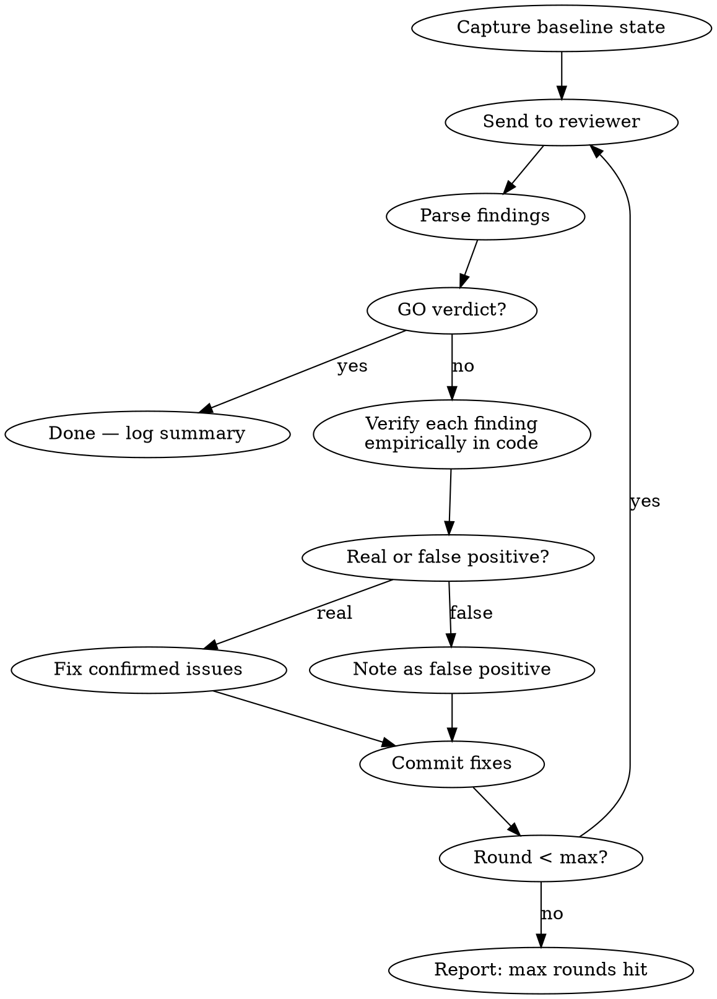

# Adversarial Review Loop

**Core principle:** Send artifact to an external reviewer, verify each finding empirically, fix confirmed issues, re-send — repeat until GO.

Proven: 37 real issues found in 7 rounds, 0 false positives.

## When to Use

- Spec/design docs before implementation (will scripts be built from this?)
- Config changes before deployment (will this break production?)
- Documentation claims before publishing (are facts verified?)
- Any artifact where "wrong = costly" and a second opinion helps

**Do NOT use for:** Quick questions, trivial edits, code that has tests covering it.

## Depth Levels

| Level | Max rounds | When |
|-------|-----------|------|
| `quick` | 1 | Sanity check, low stakes |
| `standard` | 3 | Normal work, moderate stakes |
| `exhaustive` | until GO (cap 10) | High stakes, spec drives automation |

Default: `standard`. Override via argument: `/adversarial-review exhaustive`

## Process



### Step-by-step

**1. Setup** — create state file, capture baseline:
```bash
mkdir -p .adversarial-review
echo '{"round":0,"artifact":"","findings_total":0,"fixed_total":0,"false_positives":0,"history":[]}' > .adversarial-review/state.json
```

**2. Send to reviewer** — use `codex exec` with read-only sandbox:
```bash
codex exec -s read-only -C "$(git rev-parse --show-toplevel)" \
  "Round N review. Read <ARTIFACT_PATH>. [CONTEXT]. GO/NO-GO — BLOCKERS only." \
  2>&1 | tee .adversarial-review/last-review.txt
```

Key rules for the prompt:
- Tell the reviewer what round this is
- Give context about what was fixed since last round
- Ask for GO/NO-GO verdict
- Say "BLOCKERS only" to avoid style bikeshedding
- Use `-C` to set correct working directory (avoid wrong-cwd false NO-GO)

**3. Parse findings** — extract from reviewer output:
- Find the final `codex` response block (last occurrence of `^codex$` marker in output)
- Extract verdict (GO / NO-GO)
- Extract numbered findings with severity

**4. Verify each finding** — use `/receiving-code-review` discipline:
- For each finding, run the specific command or grep that would confirm/deny it
- Classify: REAL or FALSE_POSITIVE
- Record evidence for each

**CRITICAL: Do not blindly fix reviewer findings. Verify first.**

| Reviewer says | You do |
|---------------|--------|
| "File X doesn't exist" | `ls` / `git ls-tree` to check |
| "Query returns wrong count" | Run the exact query |
| "Pattern matches false positives" | Test the regex on real data |
| "Contradicts line N" | Read both lines, compare |

**5. Fix confirmed issues** — edit the artifact, commit with finding counts:
```
docs: artifact-name vN+1 (Mth review, K findings fixed)
```

**6. Update state** — append round to history:
```json
{"round": 3, "verdict": "NO-GO", "findings": 2, "fixed": 2, "false_positives": 0}
```

**7. Loop or stop:**
- Verdict GO → done, write summary
- Round < max → go to step 2
- Round = max → report "max rounds reached, N open findings remain"

### Resuming a prior session

If codex supports session resume (`codex exec resume --last`), prefer resuming — the reviewer retains context from prior rounds. If it starts from a different cwd or stale checkout, start a fresh session instead.

## State File

`.adversarial-review/state.json` — managed by Claude, not the user:

```json
{
  "round": 3,
  "artifact": "docs/specs/auth-design.md",
  "depth": "standard",
  "started_at": "2026-05-09T10:30:00Z",
  "reviewer": "codex/gpt-5.5",
  "findings_total": 15,
  "fixed_total": 13,
  "false_positives": 2,
  "history": [
    {"round": 1, "verdict": "NO-GO", "findings": 8, "fixed": 7, "fp": 1},
    {"round": 2, "verdict": "NO-GO", "findings": 5, "fixed": 4, "fp": 1},
    {"round": 3, "verdict": "GO", "findings": 0, "fixed": 0, "fp": 0}
  ]
}
```

## Logging

**Deterministic log file:** `~/.adversarial-review.log`

Every round appends one line (append-only, never truncated):
```
2026-05-09T10:30:00+03:00 | round=1 | artifact=docs/specs/auth.md | verdict=NO-GO | findings=8 | fixed=7 | fp=1 | reviewer=codex/gpt-5.5 | project=/path/to/repo
```

Write this AFTER each round completes using the bundled script:
```bash
"${CLAUDE_PLUGIN_ROOT}/skills/adversarial-review/scripts/log-round.sh" \
  "$ROUND" "$ARTIFACT" "$VERDICT" "$FINDINGS" "$FIXED" "$FP" "$REVIEWER"
```

Then update state:
```bash
python3 "${CLAUDE_PLUGIN_ROOT}/skills/adversarial-review/scripts/update-state.py" \
  "$ROUND" "$VERDICT" "$FINDINGS" "$FIXED" "$FP" "$ARTIFACT" "$DEPTH" "$REVIEWER"
```

To review history: `column -t -s'|' ~/.adversarial-review.log`

## Configuration

Optional `.adversarial-review/config.md` in project root:

```yaml
---
reviewer_command: codex exec -s read-only
reviewer_model: gpt-5.5
max_rounds_exhaustive: 10
max_rounds_standard: 3
context_instructions: "Focus on runtime correctness, not style"
---
```

If absent, defaults apply. This file is project-specific and should be gitignored.

## Reviewer Prompt Templates

### Round 1 (fresh)
```
Round 1 review. Read <PATH>. This is a <TYPE> that will be used to <PURPOSE>.
Give concrete, actionable feedback: what's missing, what's wrong, what could
break at runtime. Be critical and specific.
```

### Round N (continuation)
```
Round N review. Read <PATH> — this is vN. Previous round had K findings, all
fixed and verified empirically: <BRIEF_LIST>. GO/NO-GO — BLOCKERS only that
would cause runtime failures or incorrect results. Style is not a blocker.
```

### Final (after GO)
```
(No more prompts. Write summary to state file and log.)
```

## Common Mistakes

| Mistake | Fix |
|---------|-----|
| Trusting reviewer blindly | Verify EVERY finding with grep/read/run before fixing |
| Not using `-C` flag | Codex may run from wrong directory → false NO-GO |
| Inlining full codex output | Write to file, read selectively (output can be 100K+) |
| Fixing style issues | Tell reviewer "BLOCKERS only" — style is noise |
| Stopping after round 1 | Round 1 typically finds 30-50% of issues; iterate |
| Not committing between rounds | Reviewer needs to see the updated file |
| Losing state on compaction | State is in `.adversarial-review/state.json`, not memory |

## Red Flags — STOP and Reassess

- Reviewer gives GO on round 1 with zero findings (likely didn't read the file — check cwd)
- Same finding reappears after you "fixed" it (your fix was wrong — re-verify)
- Round > 5 with new HIGH findings each time (artifact may need redesign, not patching)
- Reviewer output is empty or errors (check `codex --version`, network, rate limits)

## Integration with Other Skills

- **`/receiving-code-review`** — REQUIRED for the verification step. Prevents blind implementation.
- **`/verification-before-completion`** — use after final GO to confirm artifact is truly ready.
- **`/brainstorming`** — use BEFORE this skill to design the artifact; this skill reviews it.
