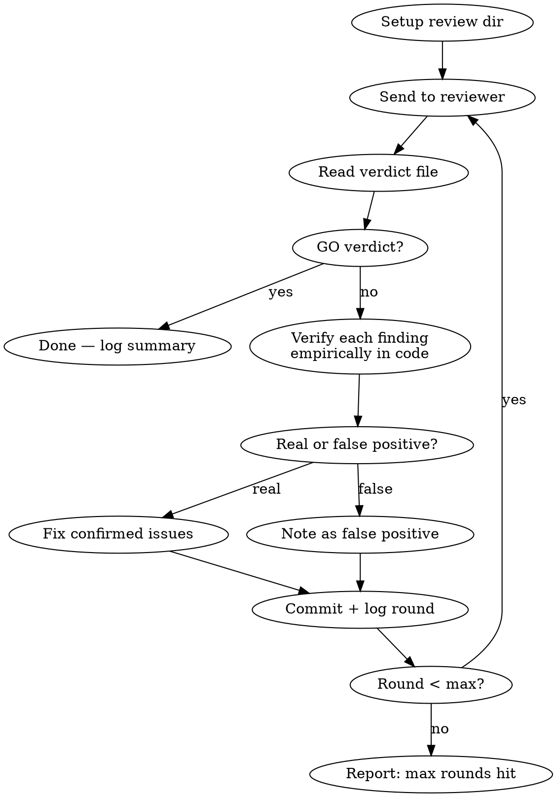

# Adversarial Review Loop

**Core principle:** Send artifact to an external reviewer, verify each finding empirically, fix confirmed issues, re-send — repeat until GO.

Proven: 37 real issues found in 7 rounds, 0 false positives.

## When to Use

- Spec/design docs before implementation (will scripts be built from this?)
- Config changes before deployment (will this break production?)
- Documentation claims before publishing (are facts verified?)
- Any artifact where "wrong = costly" and a second opinion helps

**Do NOT use for:** Quick questions, trivial edits, code that has tests covering it, free-form prompts without a concrete artifact.

## Artifact Types

The artifact must be something codex can read from the filesystem and something you can fix between rounds:

| Type | Example | Review dir name |
|------|---------|-----------------|
| File | `docs/specs/auth-design.md` | `{session}-auth-design` |
| Directory | `src/gateway/` | `{session}-gateway` |
| Git diff | current branch changes | `{session}-diff-{branch}` |

Free-form prompts without a file/dir/diff are NOT supported — the iterative fix→re-review loop requires a concrete artifact.

## Depth Levels

| Level | Max rounds | Reviewer prompt style | When |
|-------|-----------|----------------------|------|
| `quick` | 1 | "BLOCKERS only" from round 1 | Sanity check, low stakes |
| `standard` | 3 | Round 1 wide, rounds 2-3 "BLOCKERS only" | Normal work, moderate stakes |
| `exhaustive` | until GO (cap 10) | Round 1 wide, rest "BLOCKERS only" | High stakes, spec drives automation |

Default: `standard`. Override via argument: `/adversarial-review exhaustive`

## Process



### Step-by-step

**1. Setup** — create per-review directory using session ID + artifact name:
```bash
SESSION="${CLAUDE_CODE_SESSION_ID:0:8}"
ARTIFACT_NAME=$(basename "$ARTIFACT_PATH" .md)  # or dirname, or branch name for diff
REVIEW_DIR=".adversarial-review/${SESSION}-${ARTIFACT_NAME}"
mkdir -p "$REVIEW_DIR"
```

Each review gets its own isolated directory — no collisions between sessions or artifacts.

**2. Send to reviewer** — use `codex exec` with `-o` to capture clean verdict:
```bash
codex exec -s read-only \
  -o "${REVIEW_DIR}/verdict-r${ROUND}.txt" \
  -C "$(git rev-parse --show-toplevel)" \
  "Round $ROUND review. Read <ARTIFACT_PATH>. [CONTEXT]. GO/NO-GO — BLOCKERS only." \
  > "${REVIEW_DIR}/full-r${ROUND}.txt" 2>&1
```

- `verdict-r{N}.txt` — clean final answer only (via `-o` flag). **Read this.**
- `full-r{N}.txt` — complete output with all tool calls (for debugging only)

**Do NOT parse `full-r{N}.txt` for the verdict.** The `-o` flag gives you clean output directly.

**3. Read verdict** — just read the clean file:
```bash
Read "${REVIEW_DIR}/verdict-r${ROUND}.txt"
```
Extract: verdict (GO / NO-GO) and numbered findings with severity.

**4. Verify each finding** — use `/receiving-code-review` discipline:
- For each finding, run the specific command or grep that would confirm/deny it
- Classify: REAL or FALSE_POSITIVE
- Record evidence for each

**CRITICAL: Do not blindly fix reviewer findings. Verify first.**

| Reviewer says | You do |
|---------------|--------|
| "File X doesn't exist" | `ls` / `git ls-tree` to check |
| "Query returns wrong count" | Run the exact query |
| "Pattern matches false positives" | Test the regex on real data |
| "Contradicts line N" | Read both lines, compare |

**5. Fix confirmed issues** — edit the artifact, commit with finding counts:
```
docs: artifact-name vN+1 (Mth review, K findings fixed)
```

**6. Log round + update state** — one command does both:
```bash
ADVERSARIAL_REVIEW_DIR="$REVIEW_DIR" \
"${CLAUDE_PLUGIN_ROOT}/skills/adversarial-review/scripts/log-round.sh" \
  "$ROUND" "$ARTIFACT" "$VERDICT" "$FINDINGS" "$FIXED" "$FP" "$REVIEWER"
```
`ADVERSARIAL_REVIEW_DIR` tells the script which per-review dir to write `state.json` into. Must match the dir from step 1.
You MUST call this AFTER EVERY round (not just the last one).

**7. Loop or stop:**
- Verdict GO → done, write summary
- Round < max → go to step 2
- Round = max → report "max rounds reached, N open findings remain"

### Resuming a prior codex session

If codex supports session resume (`codex exec resume --last`), prefer resuming — the reviewer retains context from prior rounds. If it starts from a different cwd or stale checkout, start a fresh session instead. Use `-o` with resume too.

## Review Directory Layout

```
.adversarial-review/                        # gitignore this entire dir
  bf5a38d6-auth-design/                     # session prefix + artifact
    state.json                              # round state (managed by scripts)
    verdict-r1.txt                          # clean codex answer round 1
    verdict-r2.txt                          # clean codex answer round 2
    full-r1.txt                             # full codex output (debug)
    full-r2.txt
  e34e20d7-preset-name-storage/             # different session, different artifact
    state.json
    verdict-r1.txt
```

## Logging

**Deterministic log file:** `~/.claude/hooks/adversarial-review.log`

Every round appends one line (append-only, never truncated):
```
2026-05-09T10:30:00+03:00 | session=bf5a38d6 | round=1 | artifact=docs/specs/auth.md | verdict=NO-GO | findings=8 | fixed=7 | fp=1 | reviewer=codex/gpt-5.5 | project=/path/to/repo
```

To review history: `column -t -s'|' ~/.claude/hooks/adversarial-review.log`

## Configuration

Optional `.adversarial-review/config.md` in project root:

```yaml
---
reviewer_command: codex exec -s read-only
reviewer_model: gpt-5.5
max_rounds_exhaustive: 10
max_rounds_standard: 3
context_instructions: "Focus on runtime correctness, not style"
---
```

If absent, defaults apply. This file is project-specific and should be gitignored.

## Reviewer Prompt Templates

### Round 1 (fresh)
```
Round 1 review. Read <PATH>. This is a <TYPE> that will be used to <PURPOSE>.
Give concrete, actionable feedback: what's missing, what's wrong, what could
break at runtime. Be critical and specific.
```

### Round N (continuation)
```
Round N review. Read <PATH> — this is vN. Previous round had K findings, all
fixed and verified empirically: <BRIEF_LIST>. GO/NO-GO — BLOCKERS only that
would cause runtime failures or incorrect results. Style is not a blocker.
```

### Final (after GO)
```
(No more prompts. Log final round and write summary.)
```

## Common Mistakes

| Mistake | Fix |
|---------|-----|
| Trusting reviewer blindly | Verify EVERY finding with grep/read/run before fixing |
| Not using `-C` flag | Codex may run from wrong directory → false NO-GO |
| Parsing full output instead of `-o` | Use `-o verdict-rN.txt` — clean answer, zero parsing |
| Fixing style issues | Tell reviewer "BLOCKERS only" — style is noise |
| Stopping after round 1 | Round 1 typically finds 30-50% of issues; iterate |
| Not committing between rounds | Reviewer needs to see the updated file |
| Losing state on compaction | State is in review dir, not conversation memory |
| Not calling log-round.sh every round | State becomes incomplete — call EVERY round |

## Red Flags — STOP and Reassess

- Reviewer gives GO on round 1 with zero findings (likely didn't read the file — check cwd)
- Same finding reappears after you "fixed" it (your fix was wrong — re-verify)
- Round > 5 with new HIGH findings each time (artifact may need redesign, not patching)
- Reviewer output is empty or errors (check `codex --version`, network, rate limits)
- `verdict-rN.txt` is empty (codex crashed or `-o` path wrong)

## Integration with Other Skills

- **`/receiving-code-review`** — REQUIRED for the verification step. Prevents blind implementation.
- **`/verification-before-completion`** — use after final GO to confirm artifact is truly ready.
- **`/brainstorming`** — use BEFORE this skill to design the artifact; this skill reviews it.
