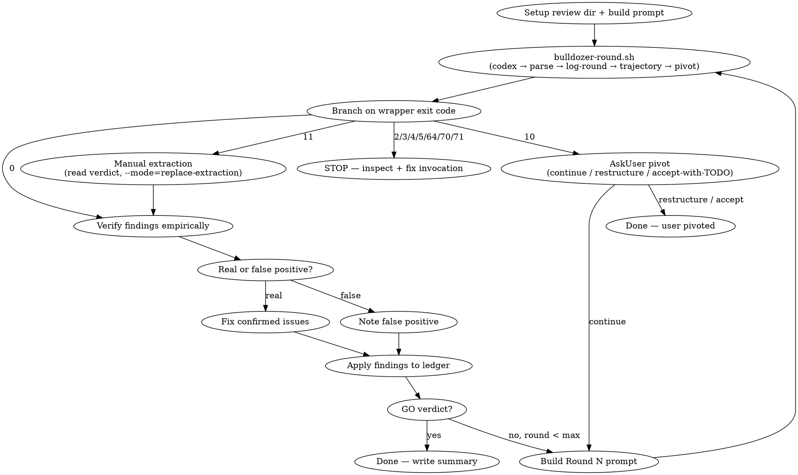

# PR-3b Structural Cluster Implementation Plan (issue #110: B1, B2, B4, B7)

> **For agentic workers:** TDD per task (visible RED → GREEN). Steps use checkbox (`- [ ]`).

**Goal:** Externalize depth config (B1) and pivot options (B4) to data files, consolidate the parser-exit diagnostics into one helper (B2), and refresh the SKILL.md digraph to the wrapper-driven flow (B7).

**Architecture:** Single-source-of-truth data files (`skills/check/data/*.json|yaml`) read by the wrapper / emit-pivot.py; a bash helper centralizing parser-exit→diagnostic mapping; an accurate control-flow digraph. No behavior change for valid inputs — only DRY + testability + doc accuracy.

**Tech Stack:** bash (`bulldozer-round.sh`), python3 (`read-depth-config.py`, `emit-pivot.py`), PyYAML 6.0.3 (available), pytest.

**Branch:** `bulldozer/feat/pr3b-structural-cluster` off `bulldozer/main` @ 6cf8def. Plain feature branch (no worktree), per spec.

**Source of truth:** `docs/superpowers/specs/2026-05-28-issue-110-roadmap-design.md` → PR-3 § (B1/B2/B4/B7 lines 112-117).

**Out of scope (deliberate YAGNI deferrals):**
- B4 project-level override (`.bulldozer/pivot-options.yaml`) — spec mentions it but there is no consumer; couples emit-pivot.py to the dir layout. Ship plugin-default + graceful fallback only. Revisit if dogfood insists.
- CalVer bump — auto-calver post-merge hook handles it. Do NOT edit plugin.json version.

---

## Task 1 — B1: externalize depth config to `data/depth-config.json`

**Problem:** depth→params mapping is duplicated in 3 wrapper sites (preflight depth `case` ~L176-182; codex_args reasoning+`--ephemeral`+prompt_prefix `case` ~L299-307; max_rounds `case` ~L625-630) + the SKILL.md "Depth Levels" table (L107-113). Four copies drift.

**Files:**
- Create: `skills/check/data/depth-config.json`
- Create: `skills/check/scripts/read-depth-config.py`
- Modify: `skills/check/scripts/bulldozer-round.sh`
- Modify: `skills/check/SKILL.md` (depth table → add canonical-source pointer)
- Test: `tests/test_check_round_wrapper.py` (new `TestReadDepthConfigScript`, `TestDepthConfigContract`)

**`data/depth-config.json`:**
```json
{
  "quick":      {"max_rounds": 1,  "reasoning": "medium", "ephemeral": true,  "prompt_prefix": "SKIP SKILLS. "},
  "standard":   {"max_rounds": 3,  "reasoning": "xhigh",  "ephemeral": false, "prompt_prefix": ""},
  "exhaustive": {"max_rounds": 10, "reasoning": "xhigh",  "ephemeral": false, "prompt_prefix": ""}
}
```

**`read-depth-config.py`** — prints `max_rounds\treasoning\tephemeral\tprompt_prefix` (TAB-delimited; prompt_prefix LAST so its significant trailing space survives `IFS=$'\t' read`). Exit 0 ok; **2** unknown depth (→ wrapper maps to 64 usage); **3** corrupt/unreadable config (→ wrapper 70). Wrapped CLI under `main()` + `if __name__ == "__main__"` so helpers are importable.

**Wrapper edits:**
1. After the existing `--depth` preflight region, resolve `DEPTH_CONFIG` (`…/skills/check/data/depth-config.json`) and `READ_DEPTH_CONFIG` (`…/skills/check/scripts/read-depth-config.py`) with the same `CLAUDE_PLUGIN_ROOT`-with-`SCRIPT_DIR` fallback as PARSER; pre-validate each exists → `_emit_stop 70`. Config path uses `${SCRIPT_DIR}/../data/depth-config.json` for the fallback.
2. Replace the `case "$DEPTH" in quick|standard|exhaustive) : ;;` validation with: run `read-depth-config.py`, capture exit (`2`→`exit 64` bad depth; non-0/2→`_emit_stop 70`), then `IFS=$'\t' read -r max_rounds reasoning ephemeral prompt_prefix <<< "$depth_cfg_out"`.
3. codex_args `case` → build from vars: `codex_args+=(-c "model_reasoning_effort=${reasoning}")` and `[[ "$ephemeral" == "true" ]] && codex_args+=(--ephemeral)`. `prompt_prefix` already set by the read (drop its assignment here).
4. Delete the max_rounds `case` (~L625-630) — `max_rounds` already set from the read.

**SKILL.md:** keep the L107-113 table; add a line: "`skills/check/data/depth-config.json` is the canonical source the wrapper reads; this table mirrors it (kept in sync by `TestDepthConfigContract`)."

**TDD steps:**
- [ ] 1.1 Write `TestReadDepthConfigScript` tests (subprocess) → RED (script absent):
  - quick → stdout exactly `"1\tmedium\ttrue\tSKIP SKILLS. "` (assert trailing space preserved)
  - standard → `"3\txhigh\tfalse\t"`; exhaustive → `"10\txhigh\tfalse\t"`
  - unknown depth `"bogus"` → returncode 2
  - corrupt json (tmp file `"{") → returncode 3 (or ≠0,≠2)
  - missing config file → returncode ≠0
- [ ] 1.2 Run → confirm RED (FileNotFound / nonzero).
- [ ] 1.3 Create `data/depth-config.json` + `read-depth-config.py`. Run → GREEN.
- [ ] 1.4 Write `TestDepthConfigContract::test_matches_skill_md_table` — parse JSON + parse the SKILL.md table rows; assert max_rounds + reasoning + ephemeral(`--ephemeral` present?) + prefix(`SKIP SKILLS.`?) agree for all 3 depths. Run → GREEN (fix JSON or table if mismatch).
- [ ] 1.5 Refactor wrapper (edits 1-4). Run FULL `test_check_round_wrapper.py` — existing `TestAskUserPivot` (max=1 quick / 3 standard / 10 exhaustive) + `TestCodexInvocation` (`test_skip_skills_prefix_appears_exactly_once_for_quick`, `test_codex_invoked_with_model_from_reviewer`) are the regression net for behavior preservation. Must stay GREEN.
- [ ] 1.6 Add structural guard `test_wrapper_has_depth_config_70_guard` (source regex: `DEPTH_CONFIG` resolution + `_emit_stop 70`). Run → GREEN.
- [ ] 1.7 Commit: `refactor(check): B1 — externalize depth config to data/depth-config.json (#110)`.

---

## Task 2 — B2: consolidate parser-exit diagnostics into `_emit_parser_exit_diagnostic`

**Problem:** parser-exit `case` (~L472-548) has a sprawling per-code body (2/3/4/5/`*`). Adding a parser code needs synced edits. (JSON-table approach REJECTED in spec — branches have dynamic `${VERDICT_FILE%.txt}.malformed.yml` / FULL_LOG interpolation.)

**Files:**
- Modify: `skills/check/scripts/bulldozer-round.sh`
- Test: `tests/test_check_round_wrapper.py` (new `TestParserExitContract`)

**Design:** define `_emit_parser_exit_diagnostic CODE` near `_emit_stop` (top); it `case`s on the code → the same `_emit_stop` calls currently inline (2→`_emit_stop 2`, 3→3, 4→4, 5→5, `*`→70). Reads `VERDICT_FILE`/`FULL_LOG` from outer scope. Main case collapses to:
```bash
case "$parser_exit" in
    0) : ;;                                   # success
    1) ... manual-extraction (unchanged) ... ;;
    *) _emit_parser_exit_diagnostic "$parser_exit" ;;
esac
```
Exit 0 (success) and 1 (manual-extraction, control-flow side effects) stay in main; 2/3/4/5/unknown route through the helper.

**TDD steps:**
- [ ] 2.1 Write `TestParserExitContract::test_every_documented_parser_exit_has_wrapper_handling` — parse the `Exit codes:` block of `parse-ledger-patch.py` docstring → `{0,1,2,3,4,5}`; assert wrapper source handles each (0 + 1 in main `case`; 2/3/4/5 via helper branches; `*` catch-all present). Run → GREEN against current source (it already has all branches — this is a drift-guard).
- [ ] 2.2 Prove it BITES (mutation): temporarily delete the `4)` branch from the current case → run → RED. Restore → GREEN. (Discipline analog to PR-3a B3 goldens.)
- [ ] 2.3 Extract `_emit_parser_exit_diagnostic`; rewrite main case to `0`/`1`/`*`. Run FULL suite — existing `TestParserExitTwo/Three/Four/Five` + `TestExitCodeContract::test_unexpected_parser_exit_maps_to_70` are the behavioral regression net. Must stay GREEN (helper output byte-identical).
- [ ] 2.4 Re-run `TestParserExitContract` (now must match the helper-based structure). Adjust the contract test's source-pattern to find branches inside the helper. GREEN.
- [ ] 2.5 Commit: `refactor(check): B2 — _emit_parser_exit_diagnostic helper (#110)`.

---

## Task 3 — B4: externalize pivot options to `data/pivot-options.yaml`

**Problem:** `emit-pivot.py` hardcodes the 3 pivot options. 4th option = code edit.

**Files:**
- Create: `skills/check/data/pivot-options.yaml`
- Modify: `skills/check/scripts/emit-pivot.py` (wrap CLI in `main()`; add `_load_options(cfg=None)` + `_BUILTIN_OPTIONS`)
- Test: `tests/test_check_round_wrapper.py` (new `TestPivotOptionsLoader`; existing `TestEmitPivotScript` + `b3-char-pivot.golden` regression)

**`data/pivot-options.yaml`:**
```yaml
# Pivot options when /bulldozer:check hits max rounds without GO.
# emit-pivot.py renders these into pivot-rN.json (AskUserQuestion-compatible).
# Add a 4th option here — no code change. Missing/corrupt → built-in fallback.
options:
  - label: continue
    description: "Run another round (exceeds max for this depth)"
  - label: restructure
    description: "Pause review, restructure the artifact, re-launch /bulldozer:check"
  - label: accept-with-TODO
    description: "Accept current state, log open findings as project TODOs"
```

**emit-pivot.py:** wrap arity-check + write logic in `main()`, call under `if __name__ == "__main__": main()` (so importlib can load `_load_options` without triggering the CLI / arity sys.exit). `_load_options(cfg=None)` defaults `cfg = Path(__file__).resolve().parent.parent / "data" / "pivot-options.yaml"`; falls back to `_BUILTIN_OPTIONS` (== the current 3) with a stderr `warning:` on: PyYAML ImportError, OSError/YAMLError, no/empty `options` list, or any option missing string `label`/`description`. `pivot["options"] = _load_options()`.

**Note:** output stays byte-identical to PR-3a (same 3 options) → `b3-char-pivot.golden` keeps passing = built-in regression proof.

**TDD steps:**
- [ ] 3.1 Write `TestPivotOptionsLoader` (importlib-load emit-pivot.py as module `emit_pivot`):
  - `test_load_reads_yaml` — tmp yaml w/ 3 options → returns them. RED: `_load_options` AttributeError.
  - `test_load_fallback_missing` — nonexistent path → `_BUILTIN_OPTIONS`.
  - `test_load_fallback_corrupt` — tmp malformed yaml → built-in + stderr warning.
  - `test_load_fallback_bad_schema` — yaml `{}` / `{options: 5}` → built-in.
  - `test_builtin_has_three_options` — schema pin on `_BUILTIN_OPTIONS`.
- [ ] 3.2 Run → RED (module has no `_load_options` / `main`; importlib exec currently runs CLI → also fails). 
- [ ] 3.3 Refactor emit-pivot.py (main() wrap + `_load_options` + `_BUILTIN_OPTIONS`); create `data/pivot-options.yaml`. Run → GREEN.
- [ ] 3.4 Add `TestPivotOptionsLoader::test_emit_pivot_output_options_match_data_file` — run emit-pivot.py subprocess, load pivot-rN.json, assert `options == yaml.safe_load(data/pivot-options.yaml)["options"]`. GREEN (contract; bites if yaml mutated).
- [ ] 3.5 Run existing `TestEmitPivotScript` + `TestB3Characterization` (golden) — must stay GREEN.
- [ ] 3.6 Commit: `refactor(check): B4 — externalize pivot options to data/pivot-options.yaml (#110)`.

---

## Task 4 — B7: refresh SKILL.md digraph to wrapper-driven flow

**Problem:** `digraph review_loop` (SKILL.md L117-147) shows pre-PR1b architecture (Send→Read→Empty?→Extract→Apply→Commit+log as separate nodes). Reality: one `bulldozer-round.sh` node + exit-code branches incl. exit-11 manual-extraction (B5) and exit-10 pivot.

**Files:**
- Modify: `skills/check/SKILL.md` (digraph block only)
- Test: `tests/test_skill_prompts.py` (new `TestDigraphRefresh`)

**New digraph (draft — finalize against prose at edit time):**


**TDD steps:**
- [ ] 4.1 Write `TestDigraphRefresh::test_digraph_reflects_wrapper_flow` — extract the ```dot block; assert it contains `bulldozer-round.sh`, a `11`-labelled manual-extraction edge, a `10`-labelled pivot edge, and does NOT contain the stale `"Empty?"` / `"Rerun same round"` nodes. Run → RED (current digraph lacks these / has stale nodes).
- [ ] 4.2 (Optional) `test_digraph_parses_with_dot` — `skipif shutil.which("dot") is None`; run `dot -Tsvg` on the extracted block, assert returncode 0.
- [ ] 4.3 Rewrite the digraph block. Run → GREEN.
- [ ] 4.4 Commit: `docs(check): B7 — refresh review_loop digraph to wrapper-driven flow (#110)`.

---

## Verification (whole PR)

```bash
cd /0/ANTHROPICS_DEV/jaine-plugins/plugins/bulldozer
python3 -m pytest tests/test_check_round_wrapper.py tests/test_skill_prompts.py tests/test_parse_ledger_patch.py -q
python3 -m pytest tests/ -q -k "not e2e"   # full regression (excl. browser e2e)
```
Each new test: watch RED before edit, GREEN after. Verify via JUnit XML or returncode-to-file if display corruption suspected (handoff gotcha).

## Dogfood + merge

1. `bulldozer:check standard` on: `bulldozer-round.sh`, `read-depth-config.py`, `emit-pivot.py`, `data/depth-config.json`, `data/pivot-options.yaml`, `SKILL.md`, parser docstring (B2 SSOT). Reviewer `codex/gpt-5.5`. Expected 2-4 rounds (refactor-heavy). **Read `parsed-rN.json` (verdict + len(findings)) before any GO/NO-GO claim; never merge at NO-GO.**
2. Fix confirmed findings (one confirming round if a fix lands after last review).
3. PR; verify number via `gh pr list --head bulldozer/feat/pr3b-structural-cluster` immediately before merge.
4. `gh pr merge <N> --admin --squash` into `bulldozer/main`. CalVer auto-bumps (do NOT bump manually).
5. Update handoff + comment #110: B1/B2/B4/B7 closed; PR-4 (efficiency C1/C2/C3) next.
