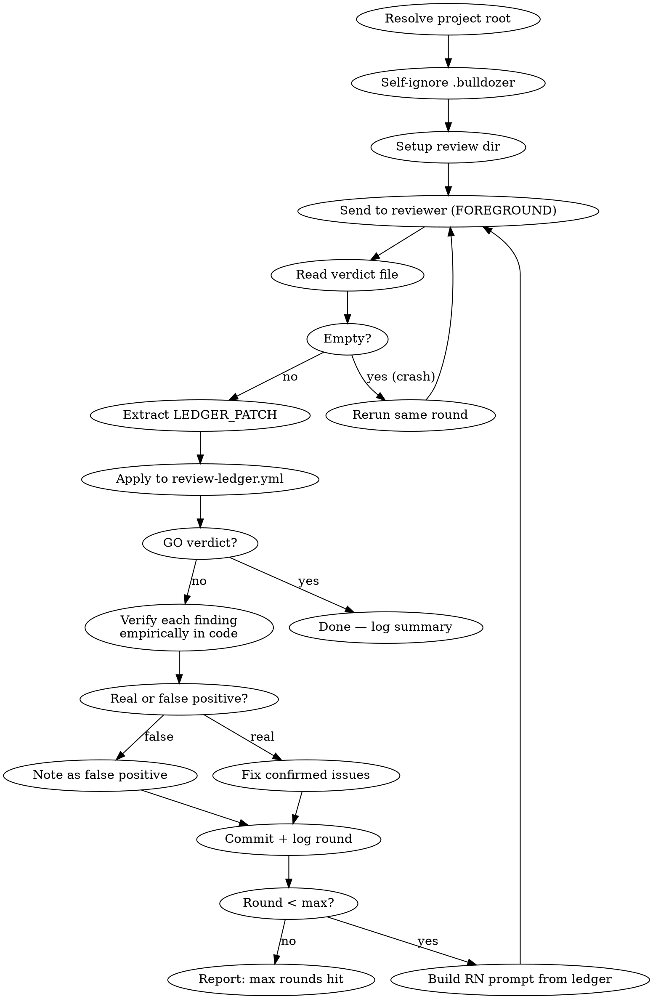

# Adversarial Review Loop

**Core principle:** Send artifact to an external reviewer, verify each finding empirically, fix confirmed issues, re-send — repeat until GO.

Proven: 37 real issues found in 7 rounds, 0 false positives.

## When to Use

- Spec/design docs before implementation (will scripts be built from this?)
- Config changes before deployment (will this break production?)
- Documentation claims before publishing (are facts verified?)
- Any artifact where "wrong = costly" and a second opinion helps

**Do NOT use for:** Quick questions, trivial edits, code that has tests covering it, free-form prompts without a concrete artifact.

## Step 1: Model Selection (EVERY launch)

Before any other action, discover available models and ask the user which one to use.

**1a. Get available models** — run:
```bash
if ! codex_output=$(codex debug models 2>&1); then
    echo "ERROR: 'codex debug models' failed. Check: codex installed? logged in? (codex login)" >&2
    exit 1
fi
printf '%s' "$codex_output" | python3 -c "
import json, sys
try:
    data = json.load(sys.stdin)
except (json.JSONDecodeError, ValueError):
    print('ERROR: codex returned non-JSON output', file=sys.stderr)
    sys.exit(1)
models = data.get('models', [])
if not models:
    print('ERROR: empty model catalog', file=sys.stderr)
    sys.exit(1)
listed = [m for m in models if m.get('visibility') == 'list']
if not listed:
    print(f'ERROR: no models with visibility=list ({len(models)} models found, schema may have changed)', file=sys.stderr)
    sys.exit(1)
for m in listed:
    slug = m.get('slug')
    if not slug: continue
    name = m.get('display_name', slug)
    print(f'{slug}|{name}|{m.get(\"priority\", 999)}')
"
```

If the snippet exits non-zero, tell the user to check `codex --version` and `codex login`, then ask them to type a model name manually.

**1b. Read saved preference** — if `.bulldozer/config.md` exists, read `reviewer_model` from its YAML frontmatter. If the file is malformed or missing the key, warn the user ("`.bulldozer/config.md` unreadable — ignoring saved preference") and let them pick fresh. Mark the saved model as "(Recommended)" in options.

**1c. Ask user** — via AskUserQuestion, show 4 models. Selection rules (in order):
1. **ALWAYS** include current global model from `~/.codex/config.toml` (line 1: `model = "..."`)
2. **ALWAYS** include last used model from `.bulldozer/config.md` (if different from global)
3. Fill remaining slots from: gpt-5.5, gpt-5.3-codex-spark, gpt-5.4-mini (skip gpt-5.4 and gpt-5.3-codex — redundant)
4. If global = last used, you get 3 slots for the above

This guarantees the user's configured model is never hidden by priority sorting.

**1d. Save choice** — update ONLY `reviewer_model` in `.bulldozer/config.md`, preserving any other keys. Pass to codex exec via `-m <model>`.

## Step 2: Parse Arguments

If no arguments provided, explain to the user:

> **Bulldozer** sends ваш артефакт (спеку, код, конфиг) на ревью внешнему AI-рецензенту (Codex CLI), затем каждый finding проверяется эмпирически в коде, фиксится, и отправляется на повторное ревью — и так до вердикта GO.
>
> **Использование:**
> ```
> /bulldozer:check path/to/spec.md              — standard (до 3 раундов)
> /bulldozer:check quick path/to/config.json     — один раунд, только блокеры
> /bulldozer:check exhaustive docs/design.md     — до полного GO (макс 10 раундов)
> /bulldozer:check standard src/gateway/         — ревью директории
> ```
>
> **Уровни глубины:**
> - `quick` — один раунд, только критичные проблемы
> - `standard` — до 3 раундов, баланс глубины и скорости (по умолчанию)
> - `exhaustive` — крутится пока рецензент не скажет GO (для спек, управляющих автоматизацией)

Then ask: what artifact to review, and which depth level.

If arguments provided, parse depth and artifact from $ARGUMENTS:
- First word matching `quick|standard|exhaustive` → depth (default: `standard`)
- Remaining → artifact path (file or directory)
- If only depth given, ask for artifact
- If only path given, use `standard` depth

## Artifact Types

The artifact must be something codex can read from the filesystem and something you can fix between rounds:

| Type | Example | Review dir name |
|------|---------|-----------------|
| File | `docs/specs/auth-design.md` | `{session}-auth-design` |
| Directory | `src/gateway/` | `{session}-gateway` |
| Git diff | current branch changes | `{session}-diff-{branch}` |

Free-form prompts without a file/dir/diff are NOT supported — the iterative fix→re-review loop requires a concrete artifact.

## Depth Levels and Codex Configuration

| Level | Max rounds | Reasoning | Prompt prefix | When |
|-------|-----------|-----------|---------------|------|
| `quick` | 1 | `-c model_reasoning_effort=medium --ephemeral` | `SKIP SKILLS.` | Sanity check, low stakes |
| `standard` | 3 | `-c model_reasoning_effort=xhigh` | (none) | Normal work, moderate stakes |
| `exhaustive` | until GO (cap 10) | `-c model_reasoning_effort=xhigh` | (none) | High stakes, spec drives automation |

Default: `standard`. Override via argument: `/bulldozer:check exhaustive`



### Step-by-step

**1. Setup** — create per-review directory using session ID + artifact name:
```bash
SESSION="${CLAUDE_CODE_SESSION_ID:0:8}"
ARTIFACT_NAME=$(basename "$ARTIFACT_PATH" .md)  # or dirname, or branch name for diff
REVIEW_DIR=".bulldozer/${SESSION}-${ARTIFACT_NAME}"
mkdir -p "$REVIEW_DIR"
```

Each review gets its own isolated directory — no collisions between sessions or artifacts.

**1b. Resolve project root** — before anything else:
```bash
PROJECT_ROOT=$(git rev-parse --show-toplevel 2>/dev/null) || {
    echo "ERROR: not in a git repository. /bulldozer:check requires git context." >&2
    exit 1
}
```
If this fails, STOP the review — do not proceed with empty `$PROJECT_ROOT`.
Use `$PROJECT_ROOT` in all `-C` flags and paths below.

**1c. Self-ignoring `.bulldozer/`** — drop a single-line `.gitignore` inside `.bulldozer/` so the directory hides its own contents from git, without touching the consumer's project-level `.gitignore`. Same pattern as `.remember/`. Idempotent. Path is cwd-relative for parity with `REVIEW_DIR` (Step 1) and the downstream scripts (`log-round.sh`, `update-state.py`) that all assume `cwd == $PROJECT_ROOT` when the skill runs.
```bash
mkdir -p .bulldozer
if [[ ! -f .bulldozer/.gitignore ]]; then
    if ! echo '*' > .bulldozer/.gitignore 2>/dev/null; then
        echo "WARNING: could not write .bulldozer/.gitignore — check permissions on $(pwd)/.bulldozer. Re-run after fixing." >&2
    fi
fi
```

**2. Send to reviewer** — FOREGROUND, with `-c` reasoning override and `-o`:

```bash
# quick (medium reasoning, skip skills, ephemeral)
codex exec -s read-only -c model_reasoning_effort=medium -m "$MODEL" \
  --ephemeral \
  -o "${REVIEW_DIR}/verdict-r${ROUND}.txt" \
  -C "$PROJECT_ROOT" \
  "SKIP SKILLS. <PROMPT>" \
  < /dev/null > "${REVIEW_DIR}/full-r${ROUND}.txt" 2>&1

# standard / exhaustive (xhigh reasoning, skills/memories active)
codex exec -s read-only -c model_reasoning_effort=xhigh -m "$MODEL" \
  -o "${REVIEW_DIR}/verdict-r${ROUND}.txt" \
  -C "$PROJECT_ROOT" \
  "<PROMPT>" \
  < /dev/null > "${REVIEW_DIR}/full-r${ROUND}.txt" 2>&1
```

**CRITICAL RULES:**
- **FOREGROUND ONLY.** NEVER use `run_in_background`. The `-o` verdict file is written LAST — polling is unreliable.
- **Check exit code.** If codex exits non-zero, read last 20 lines of `full-r{N}.txt` for diagnostics, mark round as `crash` in ledger, and report the specific error to the user. Do NOT silently retry.
- **`< /dev/null`** — prevents codex from waiting on stdin. Note: this also blocks codex re-auth prompts. If codex exits with auth error, tell the user to run `codex login` manually.
- **`2>&1`** — captures stderr into `full-r{N}.txt` for crash diagnostics. Hook noise ends up here too, but verdict is always in `-o` file.
- **`-m "$MODEL"`** — model chosen by user at launch via AskUserQuestion.
- **`-C "$PROJECT_ROOT"`** — resolved in Step 1b. Never use `$(git rev-parse ...)` inline — it silently returns empty outside git repos.

**3. Read verdict** — ONLY the clean file:
```bash
Read "${REVIEW_DIR}/verdict-r${ROUND}.txt"
```

**NEVER parse `full-r{N}.txt` for the verdict.** It contains 1000+ hook lines, file contents, and tool call noise. The `-o` flag gives clean output directly.

**4. Extract LEDGER_PATCH** — the verdict ends with a YAML block:
```yaml
LEDGER_PATCH:
  findings:
    - id: R1-F1
      severity: high
      status: open
      title: "side effect before permission check"
      files:
        - path: "src/a.py"
          lines: "120-148"
      original_verdict_excerpt: |
        The ACL check runs after the write...
      required_recheck:
        instructions: "Verify permission check happens before write"
        commands:
          - "grep -n 'check_acl' src/a.py"
```

Claude extracts this block and applies it to `${REVIEW_DIR}/review-ledger.yml`.

**Error handling for LEDGER_PATCH:**
- **Missing** (reviewer didn't output it): Claude extracts findings from prose and builds the ledger entry manually. Note this in the ledger as `patch_source: manual`.
- **Malformed YAML** (bad indentation, missing fields): Do NOT apply. Save the raw block to `verdict-r{N}.malformed.yml` alongside the verdict. Ask the user before proceeding.
- **Schema violation** (e.g., `severity: critical` instead of `blocker|high|medium|low|info`): Normalize to nearest valid value and note in history.
- **Multiple LEDGER_PATCH blocks**: Use only the LAST one (closest to end of verdict).

**MVP limitation:** Schema validation is informational — Claude applies LEDGER_PATCH manually; no validator script yet.

**5. Verify each finding** — use `/receiving-code-review` discipline:
- For each finding, run the specific command or grep that would confirm/deny it
- Classify: REAL or FALSE_POSITIVE
- Record evidence for each
- Update finding status in `review-ledger.yml`

**CRITICAL: Do not blindly fix reviewer findings. Verify first.**

| Reviewer says | You do |
|---------------|--------|
| "File X doesn't exist" | `ls` / `git ls-tree` to check |
| "Query returns wrong count" | Run the exact query |
| "Pattern matches false positives" | Test the regex on real data |
| "Contradicts line N" | Read both lines, compare |

**6. Fix confirmed issues** — edit the artifact, commit with finding counts:
```
docs: artifact-name vN+1 (Mth review, K findings fixed)
```

**7. Log round + update state** — one command does both:
```bash
BULLDOZER_REVIEW_DIR="$REVIEW_DIR" \
BULLDOZER_DEPTH="$DEPTH" \
"${CLAUDE_PLUGIN_ROOT}/skills/check/scripts/log-round.sh" \
  "$ROUND" "$ARTIFACT" "$VERDICT" "$FINDINGS" "$FIXED" "$FP" "$REVIEWER"
```
- `BULLDOZER_REVIEW_DIR` tells `update-state.py` which per-review dir to write `state.json` into — without it, state goes to `.bulldozer/state.json` (top-level, wrong).
- `BULLDOZER_DEPTH` records depth level in state — without it, defaults to `standard` regardless of actual depth.
- You MUST call this AFTER EVERY round (not just the last one).

**8. Loop or stop:**
- Verdict GO → done, write summary
- Round < max → build Round N prompt from ledger, go to step 2
- Round = max → report "max rounds reached, N open findings remain"

## Reviewer Prompt Templates

### Round 1 — quick

```
SKIP SKILLS. You are reviewing <PATH>.
This is a <TYPE> that will be used for <PURPOSE>.
Find correctness bugs, regressions, security risks, missing tests. Ignore style.
Keep each finding under 180 words. GO if no material findings.
End your response with a LEDGER_PATCH YAML block:

LEDGER_PATCH:
  findings:
    - id: R1-F1
      severity: blocker|high|medium|low|info
      status: open
      title: "short description"
      files: [{path: "...", lines: "..."}]
      original_verdict_excerpt: "your finding text"
      required_recheck:
        instructions: "what to verify"
        commands: ["command1", "command2"]
```

### Round 1 — standard / exhaustive

**CRITICAL: Adapt the prompt to the artifact type.** A design spec for a FUTURE feature must NOT be checked for "do these files exist" — they don't exist yet. Check internal consistency, feasibility, and completeness instead.

```
You are performing a <DEPTH> code review of <PATH>.
This is a <TYPE> that will be used for <PURPOSE>.

IMPORTANT: If this is an implementation plan or design spec for a FUTURE feature,
do NOT check whether described files/functions exist yet — they will be created.
Instead verify: internal consistency, feasibility, edge cases, missing requirements,
and whether the spec gives enough detail to implement correctly.

Read the relevant implementation, tests, configs, and docs before judging.
Prioritize behavioral bugs, regressions, data loss, security, concurrency, API incompatibility, and test gaps.

For every finding output:
- ID: R1-FN
- Severity: blocker|high|medium|low|info
- File/lines
- Problem
- Impact
- Required fix
- Required recheck (exact commands)
- Evidence

If no material findings, output exactly: GO.
Do not pad. Do not include style-only comments.
End your response with a LEDGER_PATCH YAML block listing all findings.
```

### Round N (continuation with ledger)

```
This is review round <N> of <PATH>.
Do BOTH:
1. Fresh review of current HEAD as if no previous review existed.
2. Ledger recheck of all non-terminal findings from previous rounds.

APPENDIX A — review-ledger.yml:
<FULL LEDGER CONTENT>

APPENDIX B — previous verdict:
<FULL verdict-r{N-1}.txt CONTENT>

For each open/fixed finding, decide: verified, still_open, false_positive, or wontfix.
If a claimed-fixed issue still reproduces, keep the original ID and explain why.
New findings use IDs R{N}-FN.
End your response with a LEDGER_PATCH YAML block covering both recheck results and new findings.
GO only when all material findings are terminal AND fresh review found nothing new.
```

## Review Ledger Format

`review-ledger.yml` — cumulative, append-only. Findings never deleted, only status changes.

```yaml
schema: review-ledger/v1
artifact: "path/to/artifact"
depth: standard
model: gpt-5.5
rounds:
  - round: 1
    date: "2026-05-12"
    result: no-go          # go | no-go | crash
    verdict_file: "verdict-r1.txt"
  - round: 2
    date: "2026-05-12"
    result: go
    verdict_file: "verdict-r2.txt"
  # crash example:
  # - round: 3
  #   date: "2026-05-12"
  #   result: crash
  #   verdict_file: null
  #   error: "codex exit 1 — auth expired"
findings:
  - id: R1-F1
    severity: high
    status: verified  # open → fixed → verified
    introduced_round: 1
    last_seen_round: 2
    title: "side effect before permission check"
    files:
      - path: "src/a.py"
        lines: "120-148"
    original_verdict_excerpt: |
      The ACL check runs after the write...
    required_recheck:
      instructions: "Verify permission check happens before write"
      commands:
        - "grep -n 'check_acl' src/a.py"
    history:
      - round: 1
        status: open
        note: "Reported"
      - round: 2
        status: verified
        note: "Fix confirmed — check_acl moved before write_data"
```

**Status lifecycle:** `open` → `fixed` (user claims) → `verified` / `still_open` / `false_positive` / `wontfix`

## Review Directory Layout

```
.bulldozer/                                    # .gitignore inside ('*') hides this dir from git — no project-level entry needed
  .gitignore                                  # one line: *
  bf5a38d6-auth-design/                        # session prefix + artifact
    review-ledger.yml                          # cumulative ledger (managed by Claude)
    verdict-r1.txt                             # clean codex answer round 1
    verdict-r2.txt                             # clean codex answer round 2
    full-r1.txt                                # full codex output (debug only)
    full-r2.txt
    state.json                                 # round state (managed by scripts)
```

## Error Handling

| Situation | Action |
|-----------|--------|
| `verdict-r{N}.txt` is empty or missing | Mark round as `crash` in ledger. Check `full-r{N}.txt` for errors. Rerun same round number. Max 2 retries — if both fail, stop and report "codex produced no output twice; check `codex --version`, `codex login`, network, disk space". |
| Both verdict and `full-r{N}.txt` empty | Codex didn't start or crashed immediately. Check PATH, auth (`codex login`), disk space. Do NOT retry blindly. |
| GO on round 1 with zero findings | Red flag — likely didn't read the file. For standard/exhaustive: require second pass. For quick: accept if user explicitly chose quick. |
| Same finding reappears after "fixed" | Keep original ID, set `status: still_open`, append history note "fix insufficient". |
| 10 rounds without GO (exhaustive) | Stop automatic rounds. Produce escalation report grouped by root cause. |
| Codex timeout / network error | Retry once. If second failure, report specific exit code and last 20 lines of `full-r{N}.txt`. |
| Codex auth expired | `< /dev/null` blocks re-auth prompts. Tell user to run `codex login`, then retry. |

## Logging

**Deterministic log file:** `~/.claude/hooks/bulldozer.log`

Every round appends one line (append-only, never truncated):
```
2026-05-09T10:30:00+03:00 | session=bf5a38d6 | round=1 | artifact=docs/specs/auth.md | verdict=NO-GO | findings=8 | fixed=7 | fp=1 | reviewer=codex/gpt-5.5 | project=/path/to/repo
```

To review history: `column -t -s'|' ~/.claude/hooks/bulldozer.log`

## Configuration

Optional `.bulldozer/config.md` in project root:

```yaml
---
reviewer_model: gpt-5.5
---
```

`reviewer_model` is updated by the model selection prompt on each launch. Save updates ONLY `reviewer_model`, preserving all other keys if present.

## Common Mistakes

| Mistake | Fix |
|---------|-----|
| Running codex in background | **FOREGROUND ONLY.** `-o` file is written LAST — polling is unreliable |
| Parsing `full-r{N}.txt` for verdict | Use `-o verdict-rN.txt` — clean answer, zero parsing |
| Trusting reviewer blindly | Verify EVERY finding with grep/read/run before fixing |
| Not using `-C` flag | Codex may run from wrong directory → false NO-GO |
| Not using `< /dev/null` | Codex may hang waiting for stdin |
| Fixing style issues | Tell reviewer "BLOCKERS only" — style is noise |
| Stopping after round 1 | Round 1 typically finds 30-50% of issues; iterate |
| Not committing between rounds | Reviewer needs to see the updated file |
| Losing state on compaction | State is in review dir and ledger, not conversation memory |
| Not calling log-round.sh every round | State becomes incomplete — call EVERY round |
| Claude summarizing findings in prose for next round | Use ledger + full previous verdict as appendix — don't lose nuance |
| Telling reviewer to "verify files exist" for a design spec | Spec describes FUTURE state — check consistency and feasibility, not filesystem |
| Modifying the consumer's project `.gitignore` | Step 1c writes a self-ignoring `.bulldozer/.gitignore` instead — no project-level changes |

## Red Flags — STOP and Reassess

- Reviewer gives GO on round 1 with zero findings (likely didn't read the file — check cwd)
- Same finding reappears after you "fixed" it (your fix was wrong — re-verify)
- Round > 5 with new HIGH findings each time (artifact may need redesign, not patching)
- Reviewer output is empty or errors (check `codex --version`, network, rate limits)
- `verdict-rN.txt` is empty (codex crashed or `-o` path wrong — check `full-rN.txt` for clues)

## Integration with Other Skills

- **`/receiving-code-review`** — REQUIRED for the verification step. Prevents blind implementation.
- **`/verification-before-completion`** — use after final GO to confirm artifact is truly ready.
- **`/brainstorming`** — use BEFORE this skill to design the artifact; this skill reviews it.

## Feedback

If you encounter friction while using this skill — documentation mismatch, missing capability, unclear error, or need a workaround — create a GitHub issue so JAINE-developer can fix it in real-time.

**Create issue when:**
1. SKILL.md describes behavior X, reality is Y
2. Had to use a workaround instead of the standard path
3. Need a feature that doesn't exist
4. Script failed with an unhelpful error message
5. No existing bulldozer skill covers the use case (use `[feedback/new-skill]` prefix)

**Do NOT create issue when:** own mistake in arguments, external problem (Codex CLI not installed, network down), or behavior documented as a known limitation.

**Command:**

```bash
gh issue create --repo A3IO/jaine-plugins \
  --label "feedback,bulldozer,check" \
  --title "[feedback/check] short description" \
  --body "$(cat <<ISSUE
## What I was doing
{task description}

## What I expected
{expected behavior}

## What happened
{actual behavior, errors}

## Workaround used
{what was done instead, or "none — blocked"}

## Environment
- Plugin version: $(jq -r .version "$CLAUDE_PLUGIN_ROOT/.claude-plugin/plugin.json")
- Skill: check
- Project: $(pwd)
ISSUE
)"
```

**For new-skill requests (trigger #5):** use title prefix `[feedback/new-skill]`, labels `feedback,bulldozer` (omit `check`).

After creating the issue, tell the user:
> "I created a feedback issue about the check skill: {URL}. Want me to continue with a workaround, or would you like to get this fixed first?"
