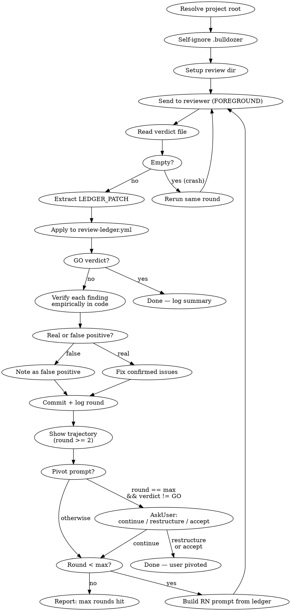

# Adversarial Review Loop

**Core principle:** Send artifact to an external reviewer, verify each finding empirically, fix confirmed issues, re-send — repeat until GO.

## When to Use

- Spec/design docs before implementation (will scripts be built from this?)
- Config changes before deployment (will this break production?)
- Documentation claims before publishing (are facts verified?)
- Any artifact where "wrong = costly" and a second opinion helps

**Do NOT use for:** Quick questions, trivial edits, code that has tests covering it, free-form prompts without a concrete artifact.

## Step 1: Model Selection (EVERY launch)

Before any other action, discover available models and ask the user which one to use.

**1a. Get available models** — run:
```bash
if ! codex_output=$(codex debug models 2>&1); then
    echo "ERROR: 'codex debug models' failed. Check: codex installed? logged in? (codex login)" >&2
    exit 1
fi
printf '%s' "$codex_output" | python3 -c "
import json, sys
try:
    data = json.load(sys.stdin)
except (json.JSONDecodeError, ValueError):
    print('ERROR: codex returned non-JSON output', file=sys.stderr)
    sys.exit(1)
models = data.get('models', [])
if not models:
    print('ERROR: empty model catalog', file=sys.stderr)
    sys.exit(1)
listed = [m for m in models if m.get('visibility') == 'list']
if not listed:
    print(f'ERROR: no models with visibility=list ({len(models)} models found, schema may have changed)', file=sys.stderr)
    sys.exit(1)
for m in listed:
    slug = m.get('slug')
    if not slug: continue
    name = m.get('display_name', slug)
    print(f'{slug}|{name}|{m.get(\"priority\", 999)}')
"
```

If the snippet exits non-zero, tell the user to check `codex --version` and `codex login`, then ask them to type a model name manually.

**1b. Read saved preference** — if `.bulldozer/config.md` exists, read `reviewer_model` from its YAML frontmatter. If the file is malformed or missing the key, warn the user ("`.bulldozer/config.md` unreadable — ignoring saved preference") and let them pick fresh. Mark the saved model as "(Recommended)" in options.

**1c. Ask user** — via AskUserQuestion, show 4 models. Selection rules (in order):
1. **ALWAYS** include current global model from `~/.codex/config.toml` (line 1: `model = "..."`)
2. **ALWAYS** include last used model from `.bulldozer/config.md` (if different from global)
3. Fill remaining slots from: gpt-5.5, gpt-5.3-codex-spark, gpt-5.4-mini (skip gpt-5.4 and gpt-5.3-codex — redundant)
4. If global = last used, you get 3 slots for the above

This guarantees the user's configured model is never hidden by priority sorting.

**1d. Save choice** — update ONLY `reviewer_model` in `.bulldozer/config.md`, preserving any other keys. Pass to codex exec via `-m <model>`.

## Step 2: Parse Arguments

If no arguments provided, explain to the user:

> **Bulldozer** sends ваш артефакт (спеку, код, конфиг) на ревью внешнему AI-рецензенту (Codex CLI), затем каждый finding проверяется эмпирически в коде, фиксится, и отправляется на повторное ревью — и так до вердикта GO.
>
> **Использование:**
> ```
> /bulldozer:check path/to/spec.md              — standard (до 3 раундов)
> /bulldozer:check quick path/to/config.json     — один раунд, только блокеры
> /bulldozer:check exhaustive docs/design.md     — до полного GO (макс 10 раундов)
> /bulldozer:check standard src/gateway/         — ревью директории
> ```
>
> **Уровни глубины:**
> - `quick` — один раунд, только критичные проблемы
> - `standard` — до 3 раундов, баланс глубины и скорости (по умолчанию)
> - `exhaustive` — крутится пока рецензент не скажет GO (для спек, управляющих автоматизацией)

Then ask: what artifact to review, and which depth level.

If arguments provided, parse depth and artifact from $ARGUMENTS:
- First word matching `quick|standard|exhaustive` → depth (default: `standard`)
- Remaining → artifact path (file or directory)
- If only depth given, ask for artifact
- If only path given, use `standard` depth

## Artifact Types

The artifact must be something codex can read from the filesystem and something you can fix between rounds:

| Type | Example | Review dir name |
|------|---------|-----------------|
| File | `docs/specs/auth-design.md` | `{session}-auth-design` |
| Directory | `src/gateway/` | `{session}-gateway` |
| Git diff | current branch changes | `{session}-diff-{branch}` |

Free-form prompts without a file/dir/diff are NOT supported — the iterative fix→re-review loop requires a concrete artifact.

## Depth Levels and Codex Configuration

| Level | Max rounds | Reasoning | Prompt prefix | When |
|-------|-----------|-----------|---------------|------|
| `quick` | 1 | `-c model_reasoning_effort=medium --ephemeral` | `SKIP SKILLS.` | Sanity check, low stakes |
| `standard` | 3 | `-c model_reasoning_effort=xhigh` | (none) | Normal work, moderate stakes |
| `exhaustive` | until GO (cap 10) | `-c model_reasoning_effort=xhigh` | (none) | High stakes, spec drives automation |

Default: `standard`. Override via argument: `/bulldozer:check exhaustive`



### Step-by-step

**1. Setup** — create per-review directory using session ID + artifact name:
```bash
SESSION="${CLAUDE_CODE_SESSION_ID:0:8}"
ARTIFACT_NAME=$(basename "$ARTIFACT_PATH" .md)  # or dirname, or branch name for diff
REVIEW_DIR=".bulldozer/${SESSION}-${ARTIFACT_NAME}"
mkdir -p "$REVIEW_DIR"
```

Each review gets its own isolated directory — no collisions between sessions or artifacts.

**1b. Resolve project root** — before anything else:
```bash
PROJECT_ROOT=$(git rev-parse --show-toplevel 2>/dev/null) || {
    echo "ERROR: not in a git repository. /bulldozer:check requires git context." >&2
    exit 1
}
```
If this fails, STOP the review — do not proceed with empty `$PROJECT_ROOT`.
Use `$PROJECT_ROOT` in all `-C` flags and paths below.

**1c. Self-ignoring `.bulldozer/`** — drop a single-line `.gitignore` inside `.bulldozer/` so the directory hides its own contents from git, without touching the consumer's project-level `.gitignore`. Same pattern as `.remember/`. Idempotent. Path is cwd-relative for parity with `REVIEW_DIR` (Step 1) and the downstream scripts (`log-round.sh`, `update-state.py`) that all assume `cwd == $PROJECT_ROOT` when the skill runs.
```bash
mkdir -p .bulldozer
if [[ ! -f .bulldozer/.gitignore ]]; then
    if ! echo '*' > .bulldozer/.gitignore 2>/dev/null; then
        echo "WARNING: could not write .bulldozer/.gitignore — check permissions on $(pwd)/.bulldozer. Re-run after fixing." >&2
    fi
fi
```

**2. Build the round prompt** — pick the right template from the Reviewer Prompt Templates section below, substitute the artifact-specific placeholders (`<PATH>`, `<TYPE>`, `<PURPOSE>`, `<DEPTH>`, etc.), and write it to a file the wrapper can read:

```bash
PROMPT_FILE="${REVIEW_DIR}/prompt-r${ROUND}.txt"
# Write the round prompt body to $PROMPT_FILE — Round 1 quick/standard or
# Round N (continuation with ledger). See "Reviewer Prompt Templates" below.
```

For Round N continuation prompts, embed the current review-ledger.yml as APPENDIX A and the previous verdict-r{N-1}.txt as APPENDIX B (templates already include the headers).

**3. Run the round** — one call composes codex → parser → log-round → trajectory → pivot signal:

```bash
"${CLAUDE_PLUGIN_ROOT}/skills/check/scripts/bulldozer-round.sh" \
  --round "$ROUND" \
  --review-dir "$REVIEW_DIR" \
  --artifact "$ARTIFACT" \
  --depth "$DEPTH" \
  --reviewer "codex/$MODEL" \
  --prompt-file "$PROMPT_FILE" \
  --project-root "$PROJECT_ROOT"
wrapper_exit=$?
```

The wrapper runs codex FOREGROUND with the right `-s read-only -m -o -C` flags + depth-specific reasoning effort, invokes `parse-ledger-patch.py` on the resulting `verdict-r${ROUND}.txt`, calls `log-round.sh` (which updates `state.json` and appends to `bulldozer.log`), prints the trajectory to stderr when `ROUND >= 2`, and on `ROUND >= max_rounds && verdict != GO` writes `pivot-r${ROUND}.json` with AskUserQuestion options and exits 10.

stdout carries the final `state.json` contents so you can read trajectory or open findings without re-reading the file.

**Wrapper exit codes — branch explicitly. Do NOT silently retry on non-zero exit.**

Codes are partitioned by origin so the caller can route mechanically without parsing stderr: `1-5` = parser outcomes, `10` = pivot, `64/70/71` = wrapper-side failures (sysexits.h convention). Reserved codes never overlap across origins — if you see `1`, the parser produced it; if `64`, the wrapper rejected the call; if `71`, codex itself crashed.

| Exit | Origin | Meaning | Your action |
|------|--------|---------|-------------|
| `0` | wrapper | Round logged successfully | Continue to Step 4 (verify findings) |
| `1` | parser | No LEDGER_PATCH block in verdict | Manual fallback: `Read "${REVIEW_DIR}/verdict-r${ROUND}.txt"`, extract findings from the prose, append them to the ledger, then continue to Step 4 |
| `2` | parser | Malformed YAML in LEDGER_PATCH | STOP. Inspect `${REVIEW_DIR}/verdict-r${ROUND}.malformed.yml` (parser saved the raw block); ask user how to proceed (fix template, retry, or pivot) |
| `3` | parser | Schema violation in LEDGER_PATCH | STOP. Patch is structurally wrong; do NOT apply. Ask user how to proceed |
| `4` | parser | PyYAML not installed | Tell user the install command (printed by wrapper) and retry |
| `5` | parser/wrapper | Verdict file empty, missing, or unreadable | Usually transient. Check `${REVIEW_DIR}/full-r${ROUND}.txt` for codex output, then retry the round |
| `10` | wrapper | Max rounds reached without GO | Read `${REVIEW_DIR}/pivot-r${ROUND}.json` and wrap its `options` array in `AskUserQuestion` (continue / restructure / accept-with-TODO). Act on the user's choice |
| `64` | wrapper | Preflight / usage error (bad flag, missing flag, bad reviewer format, missing prompt file, invalid depth, non-numeric BULLDOZER_FIXED/FP) | Fix the invocation. Diagnostic on stderr names the offending input. Do NOT retry without correcting the caller — this is a contract violation, not a transient failure |
| `70` | wrapper | Wrapper-internal failure (parser/log-round script not at expected path, log-round.sh failed during execution) | Check stderr diagnostic — typically a stale `CLAUDE_PLUGIN_ROOT` (run `jaine-sync plugins update bulldozer`) or a corrupted `state.json` in the review dir |
| `71` | wrapper | codex exec crashed | Diagnostic on wrapper stderr names the original codex exit code (preserved) and the path to `full-r${ROUND}.txt`. Report to user — do not silently retry. Common codex exits: 1 (auth expired → `codex login`), other (network, rate limit) |

Schema example codex emits (Round 1 standard / exhaustive — see "LEDGER_PATCH Protocol" below for the full schema):

```yaml
LEDGER_PATCH:
  findings:
    - id: R1-F1
      severity: high
      status: open
      title: "side effect before permission check"
      files: [{path: "src/a.py", lines: "120-148"}]
      original_verdict_excerpt: |
        The ACL check runs after the write...
      required_recheck:
        instructions: "Verify permission check happens before write"
        commands: ["grep -n 'check_acl' src/a.py"]
```

**4. Verify each finding** — use `/receiving-code-review` discipline. Read `${REVIEW_DIR}/parsed-r${ROUND}.json` (the wrapper wrote it; one entry per finding with `id`, `severity`, `files`, `original_verdict_excerpt`, `required_recheck.commands`). For each finding:

- Run the `required_recheck.commands` (or the closest equivalent) against the current code
- Classify: REAL or FALSE_POSITIVE
- Record evidence

**CRITICAL: do not blindly fix reviewer findings. Verify first.**

| Reviewer says | You do |
|---------------|--------|
| "File X doesn't exist" | `ls` / `git ls-tree` to check |
| "Query returns wrong count" | Run the exact query |
| "Pattern matches false positives" | Test the regex on real data |
| "Contradicts line N" | Read both lines, compare |

**5. Apply findings to the ledger** — append each verified finding from `parsed-r${ROUND}.json` to `${REVIEW_DIR}/review-ledger.yml`, mark status (`verified` / `still_open` / `false_positive` / `wontfix`) based on Step 4's evidence. JSON→YAML transcription is a Claude task (extraction is deterministic via the wrapper; ledger curation is judgment).

**6. Fix confirmed issues** — edit the artifact, commit with finding counts:

```
docs: artifact-name vN+1 (Mth review, K findings fixed)
```

If you want the next round's `log-round` line + `state.json` totals to record per-round fixed/false-positive counts (instead of the default 0/0), set the env vars BEFORE the next Step 3 wrapper invocation:

```bash
BULLDOZER_FIXED=K BULLDOZER_FP=M "${CLAUDE_PLUGIN_ROOT}/skills/check/scripts/bulldozer-round.sh" \
  --round "$((ROUND + 1))" ...
```

Unset them after the round (`unset BULLDOZER_FIXED BULLDOZER_FP`) so they don't leak into the round-after-next.

**7. Loop or stop:**
- Verdict GO (wrapper exit 0, parsed-rN.json has `findings: []`) → done, write summary
- Round < max, verdict NO-GO → build Round N prompt from ledger, go to Step 2
- Wrapper exited 10 (pivot signal) → act on the user's AskUserQuestion choice from Step 3 (at `ROUND >= max_rounds && verdict != GO` the wrapper always writes the pivot file and exits 10, so a `Round == max + NO-GO` case never reaches this step without a pivot signal — if it does, treat it as a wrapper-state bug and report the pivot file write failure to the operator)

## Reviewer Prompt Templates

### Round 1 — quick

```
Before reviewing, read CLAUDE.md at the project root (and any sub-CLAUDE.md
in the artifact's directory). Apply project conventions when classifying
findings as material vs. defensive.

You are reviewing <PATH>.
This is a <TYPE> that will be used for <PURPOSE>.
Find correctness bugs, regressions, security risks, missing tests. Ignore style.
Keep each finding under 180 words.

End with the LEDGER_PATCH block — see LEDGER_PATCH Protocol below.
```

### Round 1 — standard / exhaustive

**CRITICAL: Adapt the prompt to the artifact type.** A design spec for a FUTURE feature must NOT be checked for "do these files exist" — they don't exist yet. Check internal consistency, feasibility, and completeness instead.

```
Before reviewing, read CLAUDE.md at the project root (and any sub-CLAUDE.md
in the artifact's directory). Apply project conventions when classifying
findings as material vs. defensive.

You are performing a <DEPTH> code review of <PATH>.
This is a <TYPE> that will be used for <PURPOSE>.

IMPORTANT: If this is an implementation plan or design spec for a FUTURE feature,
do NOT check whether described files/functions exist yet — they will be created.
Instead verify: internal consistency, feasibility, edge cases, missing requirements,
and whether the spec gives enough detail to implement correctly.

Read the relevant implementation, tests, configs, and docs before judging.
Prioritize behavioral bugs, regressions, data loss, security, concurrency, API incompatibility, and test gaps.

For every finding output:
- ID: R1-FN
- Severity: blocker|high|medium|low|info
- File/lines
- Problem
- Impact
- Required fix
- Required recheck (exact commands)
- Evidence

Do not pad. Do not include style-only comments.

End with the LEDGER_PATCH block — see LEDGER_PATCH Protocol below.
```

### Round N (continuation with ledger)

```
This is review round <N> of <PATH>.

Before reviewing, read CLAUDE.md at the project root (and any sub-CLAUDE.md
in the artifact's directory). Apply project conventions when classifying
findings as material vs. defensive.

Do BOTH:
1. Fresh review of current HEAD as if no previous review existed.
2. Ledger recheck of all non-terminal findings from previous rounds.

APPENDIX A — review-ledger.yml:
<FULL LEDGER CONTENT>

APPENDIX B — previous verdict:
<FULL verdict-r{N-1}.txt CONTENT>

For each open/fixed finding, decide: verified, still_open, false_positive, or wontfix.
If a claimed-fixed issue still reproduces, keep the original ID and explain why.
New findings use IDs R{N}-FN.
End with the LEDGER_PATCH block covering both recheck results and new findings — see LEDGER_PATCH Protocol below.
GO only when all material findings are terminal AND fresh review found nothing new.
```

### LEDGER_PATCH Protocol

Single source of truth for the LEDGER_PATCH block referenced by all three round templates above. Future changes to the directive go here, not into individual templates (drift between Round-1 standard and Round-N was the regression that #104 caught and PR #106 hot-patched).

Every round MUST end with a LEDGER_PATCH YAML block — REQUIRED for both NO-GO and GO. The wrapper's parser extracts findings deterministically from this block; a reviewer that skips it forces the consumer back to manual prose extraction (the discipline failure PR1a / #101 was meant to eliminate).

**NO-GO shape (one or more findings):**
```yaml
LEDGER_PATCH:
  findings:
    - id: R{N}-F{M}             # round-prefixed: R1-F1, R1-F2, R2-F1, ...
      severity: blocker|high|medium|low|info
      status: open               # status lifecycle managed by consumer
      title: "short description"
      files: [{path: "...", lines: "..."}]
      original_verdict_excerpt: "your finding text verbatim"
      required_recheck:
        instructions: "what to verify"
        commands: ["command1", "command2"]
```

**GO shape (REQUIRED — do NOT emit a bare "GO" line):**
```yaml
LEDGER_PATCH:
  verdict: go
  findings: []
```

A bare `GO` line (without the LEDGER_PATCH block) is auto-synthesized by the parser as `{verdict: go, findings: []}` with `source: synthesized_bare_go` and a warning — it still works, the parser exits 0. The synthesis is suppressed if any `NO-GO` variant also appears in the verdict (exit 1 wins so real findings aren't lost). Still: prefer the explicit structured block above. Synthesis is a graceful fallback, not a green light to skip the protocol — `source: synthesized_bare_go` is a code smell in audit logs, and any time a reviewer needed to write `GO` AND a `NO-GO` example (e.g. inline documentation), synthesis flips off and the consumer ends up in manual extraction anyway.

## Review Ledger Format

`review-ledger.yml` — cumulative, append-only. Findings never deleted, only status changes.

```yaml
schema: review-ledger/v1
artifact: "path/to/artifact"
depth: standard
model: gpt-5.5
rounds:
  - round: 1
    date: "2026-05-12"
    result: no-go          # go | no-go | crash
    verdict_file: "verdict-r1.txt"
  - round: 2
    date: "2026-05-12"
    result: go
    verdict_file: "verdict-r2.txt"
  # crash example:
  # - round: 3
  #   date: "2026-05-12"
  #   result: crash
  #   verdict_file: null
  #   error: "codex exit 1 — auth expired"
findings:
  - id: R1-F1
    severity: high
    status: verified  # open → fixed → verified
    introduced_round: 1
    last_seen_round: 2
    title: "side effect before permission check"
    files:
      - path: "src/a.py"
        lines: "120-148"
    original_verdict_excerpt: |
      The ACL check runs after the write...
    required_recheck:
      instructions: "Verify permission check happens before write"
      commands:
        - "grep -n 'check_acl' src/a.py"
    history:
      - round: 1
        status: open
        note: "Reported"
      - round: 2
        status: verified
        note: "Fix confirmed — check_acl moved before write_data"
```

**Status lifecycle:** `open` → `fixed` (user claims) → `verified` / `still_open` / `false_positive` / `wontfix`

## Review Directory Layout

```
.bulldozer/                                    # .gitignore inside ('*') hides this dir from git — no project-level entry needed
  .gitignore                                  # one line: *
  bf5a38d6-auth-design/                        # session prefix + artifact
    review-ledger.yml                          # cumulative ledger (managed by Claude)
    verdict-r1.txt                             # clean codex answer round 1
    verdict-r2.txt                             # clean codex answer round 2
    full-r1.txt                                # full codex output (debug only)
    full-r2.txt
    state.json                                 # round state (managed by scripts)
```

## Error Handling

| Situation | Action |
|-----------|--------|
| `verdict-r{N}.txt` is empty or missing | Mark round as `crash` in ledger. Check `full-r{N}.txt` for errors. Rerun same round number. Max 2 retries — if both fail, stop and report "codex produced no output twice; check `codex --version`, `codex login`, network, disk space". |
| Both verdict and `full-r{N}.txt` empty | Codex didn't start or crashed immediately. Check PATH, auth (`codex login`), disk space. Do NOT retry blindly. |
| GO on round 1 with zero findings | Red flag — likely didn't read the file. For standard/exhaustive: require second pass. For quick: accept if user explicitly chose quick. |
| Same finding reappears after "fixed" | Keep original ID, set `status: still_open`, append history note "fix insufficient". |
| 10 rounds without GO (exhaustive) | Stop automatic rounds. Produce escalation report grouped by root cause. |
| Codex timeout / network error | Retry once. If second failure, report specific exit code and last 20 lines of `full-r{N}.txt`. |
| Codex auth expired | `< /dev/null` blocks re-auth prompts. Tell user to run `codex login`, then retry. |

## Logging

**Deterministic log file:** `~/.claude/hooks/bulldozer.log`

Every round appends one line (append-only, never truncated):
```
2026-05-09T10:30:00+03:00 | session=bf5a38d6 | round=1 | artifact=docs/specs/auth.md | verdict=NO-GO | findings=8 | fixed=7 | fp=1 | reviewer=codex/gpt-5.5 | project=/path/to/repo
```

To review history: `column -t -s'|' ~/.claude/hooks/bulldozer.log`

## Configuration

Optional `.bulldozer/config.md` in project root:

```yaml
---
reviewer_model: gpt-5.5
---
```

`reviewer_model` is updated by the model selection prompt on each launch. Save updates ONLY `reviewer_model`, preserving all other keys if present.

## Common Mistakes

| Mistake | Fix |
|---------|-----|
| Running codex in background | **FOREGROUND ONLY.** `-o` file is written LAST — polling is unreliable |
| Parsing `full-r{N}.txt` for verdict | Use `-o verdict-rN.txt` — clean answer, zero parsing |
| Trusting reviewer blindly | Verify EVERY finding with grep/read/run before fixing |
| Not using `-C` flag | Codex may run from wrong directory → false NO-GO |
| Not using `< /dev/null` | Codex may hang waiting for stdin |
| Fixing style issues | Tell reviewer "BLOCKERS only" — style is noise |
| Stopping after round 1 | Round 1 typically finds 30-50% of issues; iterate |
| Not committing between rounds | Reviewer needs to see the updated file |
| Losing state on compaction | State is in review dir and ledger, not conversation memory |
| Not calling log-round.sh every round | State becomes incomplete — call EVERY round |
| Claude summarizing findings in prose for next round | Use ledger + full previous verdict as appendix — don't lose nuance |
| Telling reviewer to "verify files exist" for a design spec | Spec describes FUTURE state — check consistency and feasibility, not filesystem |
| Modifying the consumer's project `.gitignore` | Step 1c writes a self-ignoring `.bulldozer/.gitignore` instead — no project-level changes |

## Red Flags — STOP and Reassess

- Reviewer gives GO on round 1 with zero findings (likely didn't read the file — check cwd)
- Same finding reappears after you "fixed" it (your fix was wrong — re-verify)
- Round > 5 with new HIGH findings each time — the wrapper prints the trajectory on stderr after every round ≥ 2 (`[bulldozer/check] Round N/M ... Trajectory: A → B → C  (avg last 3: X.X)`). If findings aren't shrinking, the AskUserQuestion pivot dialog will fire automatically at max-round NO-GO. (Note: the legacy calibrated trigger — exhaustive + round ≥ 5 + avg last 3 ≥ 3.0 — was simplified to "max rounds reached" in PR1b; calibration data from 26 historical sessions pending re-analysis as a follow-up.)
- Reviewer output is empty or errors (check `codex --version`, network, rate limits)
- `verdict-rN.txt` is empty (codex crashed or `-o` path wrong — check `full-rN.txt` for clues)

## Integration with Other Skills

- **`/receiving-code-review`** — REQUIRED for the verification step. Prevents blind implementation.
- **`/verification-before-completion`** — use after final GO to confirm artifact is truly ready.
- **`/brainstorming`** — use BEFORE this skill to design the artifact; this skill reviews it.

## Feedback

If you encounter friction while using this skill — documentation mismatch, missing capability, unclear error, or need a workaround — create a GitHub issue so JAINE-developer can fix it in real-time.

**Create issue when:**
1. SKILL.md describes behavior X, reality is Y
2. Had to use a workaround instead of the standard path
3. Need a feature that doesn't exist
4. Script failed with an unhelpful error message
5. No existing bulldozer skill covers the use case (use `[feedback/new-skill]` prefix)

**Do NOT create issue when:** own mistake in arguments, external problem (Codex CLI not installed, network down), or behavior documented as a known limitation.

**Command:**

```bash
gh issue create --repo A3IO/jaine-plugins \
  --label "feedback,bulldozer,check" \
  --title "[feedback/check] short description" \
  --body "$(cat <<ISSUE
## What I was doing
{task description}

## What I expected
{expected behavior}

## What happened
{actual behavior, errors}

## Workaround used
{what was done instead, or "none — blocked"}

## Environment
- Plugin version: $(jq -r .version "$CLAUDE_PLUGIN_ROOT/.claude-plugin/plugin.json")
- Skill: check
- Project: $(pwd)
ISSUE
)"
```

**For new-skill requests (trigger #5):** use title prefix `[feedback/new-skill]`, labels `feedback,bulldozer` (omit `check`).

After creating the issue, tell the user:
> "I created a feedback issue about the check skill: {URL}. Want me to continue with a workaround, or would you like to get this fixed first?"

<!-- test bump trigger -->

<!-- test skip -->
<!-- c9 multi-commit test code -->
